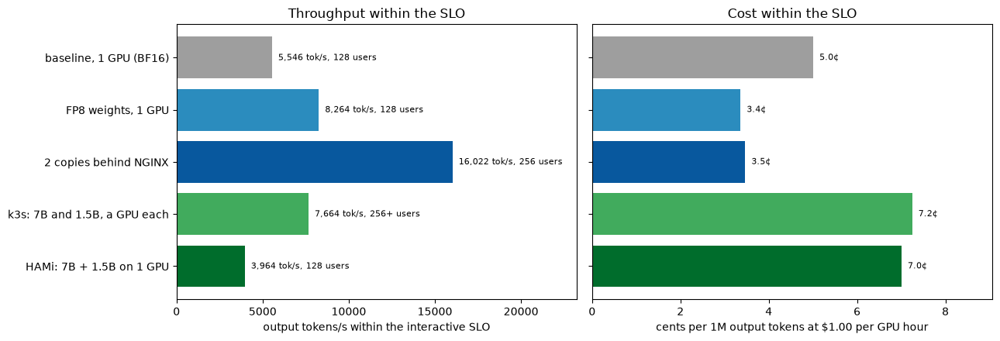

# LLM Inference Ops

A small-scale version of a production LLM serving stack, built up one phase at a time and measured at every step: a CrewAI agent and load generators, an API gateway with guardrails ("harnesses"), NGINX, and vLLM on rented RTX 5090s, with Prometheus, Grafana and Jaeger on top. It starts with one request on one GPU, breaks a single GPU under load, tunes it, scales out to two GPUs, and ends on Kubernetes with GPU sharing (HAMi) and autoscaling (KEDA).

The application isn't the point. The point is how an LLM system is run: getting requests in, generating tokens quickly and cheaply, and keeping it stable under load. **The notebooks are the proof**: every number in them is computed from the raw results in [`results/`](results/).

**Start here: [`notebooks/99_final_report.ipynb`](notebooks/99_final_report.ipynb)**

## The two minute summary

Model: Qwen2.5-7B-Instruct on vLLM 0.30.0. Hardware: NVIDIA RTX 5090 (32 GB) on Vast.ai, one GPU for Phases 0 to 5, two for Phases 6 and 7. Total GPU spend for all eight sessions: about **$11**.

| | Result |
|---|---|
| One request | **97 to 99.8% of the time is decode** (9.5 ms per token). The gateway, NGINX and HTTP add **under 3 ms** together |
| Breaking one GPU | Peaks at **5,951 output tokens/s** at 192 users. Breaks at 384 users because of vLLM's default cap of 256 running requests, not memory (KV cache 53% full). TTFT jumps from 0.5 s to 5.8 s, with zero errors |
| Tuning | **FP8 weights: +50% throughput** (8,662 tokens/s), tokens a third cheaper, **same eval score as BF16**. The FP8 KV cache (+22%) and a combined config (+99%) broke the model's answers and were rejected by the eval set |
| Harnesses | Bad requests rejected in **0.27 ms** (p50). Without them the model leaked a secret while refusing to reveal it, and spent 4 s of GPU time on requests that should never have reached it |
| Scaling out | **2 GPUs: 16,022 tokens/s (1.84×)**. Least connections beat round robin by **~10× on tail latency**. Tensor parallel was **13× slower** than two copies on these GPUs (no NVLink or peer to peer). Failover lost only the requests in flight |
| Mooncake | Reloads an evicted long prompt **2.6× faster** than recomputing it. As a shared store over TCP under load, it cut throughput by up to two thirds |
| GPU sharing (HAMi) | A 7B and a 1.5B model on **one** GPU, each with a memory limit. Same cost per 7B token as a GPU each, with half the GPUs; the small model's TTFT went from 10 to 22 ms and stayed flat under load |
| Autoscaling (KEDA) | 1 → 2 → 1 vLLM pods on requests inside vLLM. A new pod takes **139 s** to be ready; scaling in dropped 32 streams (0.1%) |

**Recommended deployment on this hardware:** FP8 weights, one copy per GPU, NGINX with least connections, harnesses on, autoscaling on vLLM's queue, small models sharing a GPU through HAMi. Within an interactive SLO (TTFT p95 ≤ 0.5 s, ITL p50 ≤ 40 ms), one RTX 5090 serves **128 concurrent streams at ~8,000 output tokens/s, 2.5 to 4.6 cents per million output tokens**.



## Architecture

```
CrewAI agent / Locust / clients
        │
        ▼
API gateway (FastAPI)     auth, rate limits, token budgets, prompt injection checks, time limits, traces
        │
        ▼
NGINX                     least connections across vLLM servers, retries, finds new servers by DNS
        │
        ▼
vLLM (one per GPU)        batching, KV cache, streaming; Mooncake as an optional KV tier in CPU memory
        │
        ▼
Prometheus · Grafana · Jaeger     38 panel dashboard, traces from the agent into vLLM's scheduler
```

In Phase 7 the same stack runs on k3s, with HAMi slicing GPUs between pods and KEDA scaling vLLM.

## Phases

| Phase | What it asked | Notebook | Headline |
|---|---|---|---|
| 0 | Does the stack come up on a rented GPU? | [00](notebooks/00_setup.ipynb) | 209k tokens of KV cache left after the 14.3 GiB model |
| 1 | Where does one request's time go? | [01](notebooks/01_single_request_walkthrough.ipynb) | Decode is 97 to 99.8%; everything else is under 3 ms |
| 2 | What does a KV cache tier (Mooncake) buy? | [02](notebooks/02_kv_cache_mooncake.ipynb) | Evicted prompts come back 2.6× faster; first visits cost 53% more |
| 3 | Can failures be stopped and seen? | [03](notebooks/03_harnesses_and_traces.ipynb) | 20/22 evals with harnesses vs 16/22 without; 6/6 failure drills |
| 4 | Where does one GPU break? | [04](notebooks/04_breaking_one_gpu.ipynb) | 384 users, at vLLM's 256 request cap, not memory |
| 5 | What fixes it? | [05](notebooks/05_profiling_and_tuning.ipynb) | FP8 weights, +50%, quality unchanged |
| 6 | How does it scale across GPUs? | [06](notebooks/06_scaling_out.ipynb) | 1.84× on 2 GPUs; least connections; copies beat tensor parallel |
| 7 | Can GPUs be shared and autoscaled? | [07](notebooks/07_gpu_slicing_hami.ipynb) | HAMi works on RTX 5090; KEDA scales on vLLM's queue |
| 8 | What does it all add up to? | [99](notebooks/99_final_report.ipynb) | The journey, lessons and a capacity plan |

The working method throughout: **profile → find the bottleneck → change one thing → benchmark → check quality → repeat.**

## Repository

| Path | What's there |
|---|---|
| [`notebooks/`](notebooks/) | One notebook per phase, plus the final report |
| [`results/`](results/) | Every raw result as JSON, with the code version and environment it came from |
| [`specification.md`](specification.md) | Hardware, software, time, cost and the key numbers for each GPU session |
| [`design_choices/`](design_choices/) | Why each phase was built the way it was, in plain language |
| [`roadmap.md`](roadmap.md) | The original phase by phase plan |
| [`gateway/`](gateway/) | FastAPI gateway with the harnesses, metrics and tracing |
| [`agent/`](agent/) | The CrewAI agent |
| [`loadtest/`](loadtest/) | Locust load tests and the analysis scripts |
| [`evals/`](evals/) | The 22 case eval set and its runner |
| [`vllm/`](vllm/) | Engine configs and the Mooncake image |
| [`observability/`](observability/) | Prometheus config and the Grafana dashboard |
| [`scripts/`](scripts/) | GPU box setup, k3s setup, experiment drivers and one run script per phase |

## Running it

Everything runs on a rented GPU VM (Ubuntu 22.04) and is scripted end to end:

```bash
# Docker Compose stack (Phases 0 to 6)
curl -fsSL https://raw.githubusercontent.com/manuhalapeth/LLM-Inference-Ops/main/scripts/setup_gpu_box.sh | bash
cd ~/LLM-Inference-Ops && ./scripts/run_phase4.sh        # or any run_phaseN.sh

# Kubernetes with HAMi and KEDA (Phase 7)
curl -fsSL https://raw.githubusercontent.com/manuhalapeth/LLM-Inference-Ops/main/scripts/setup_k3s.sh | bash
cd ~/LLM-Inference-Ops && ./scripts/run_phase7.sh
```

Then copy `results/` back and run the notebooks.

## Scope

Inference only: no training or fine-tuning. An existing open model, served and measured. This area is usually called LLMOps or inference infrastructure.
